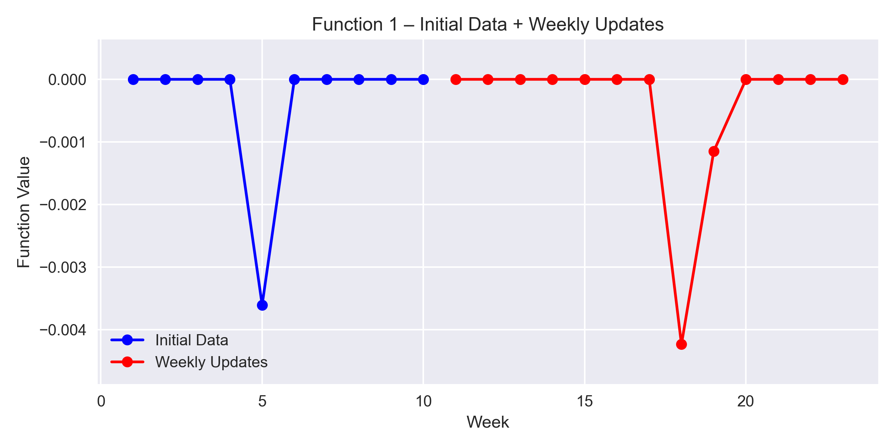
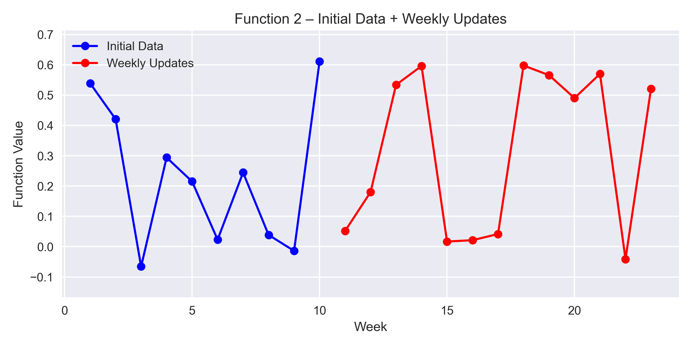
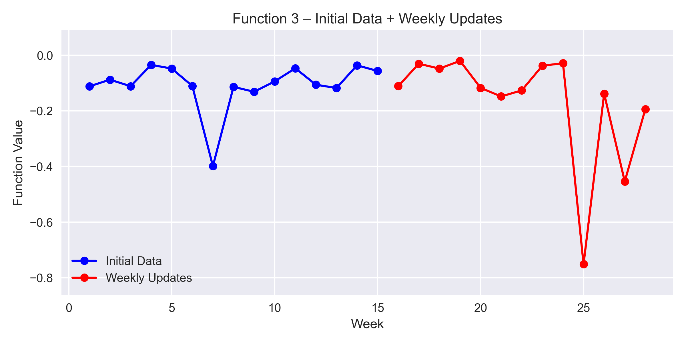
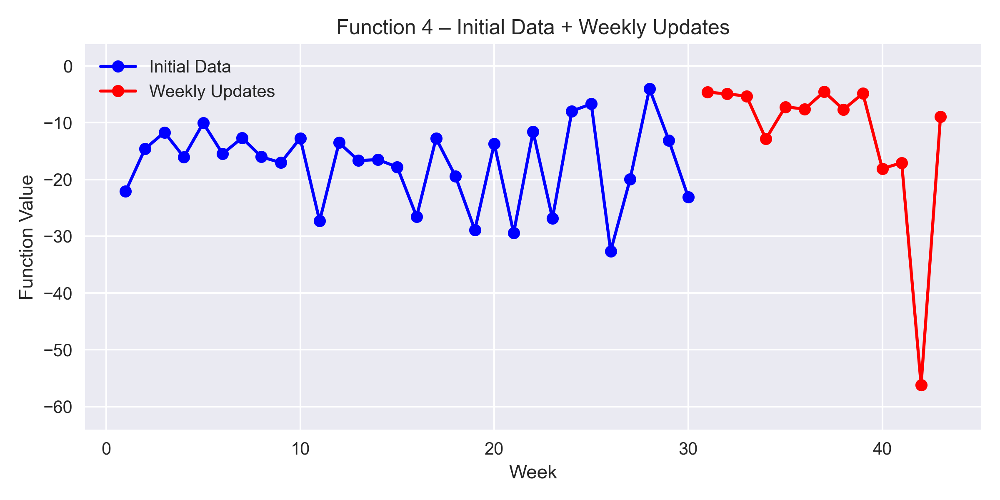
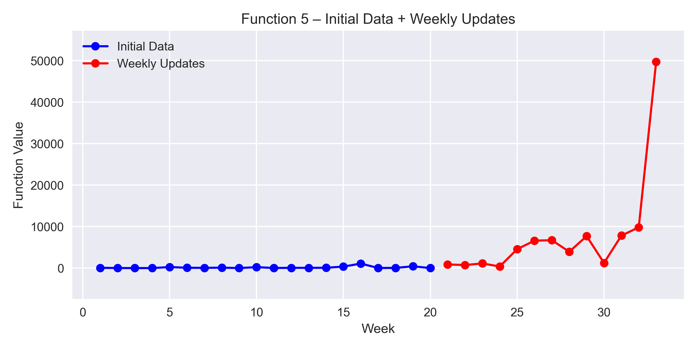
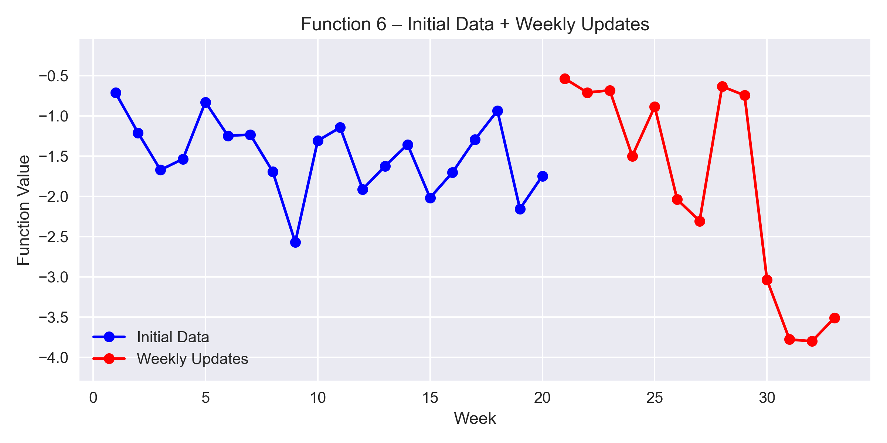
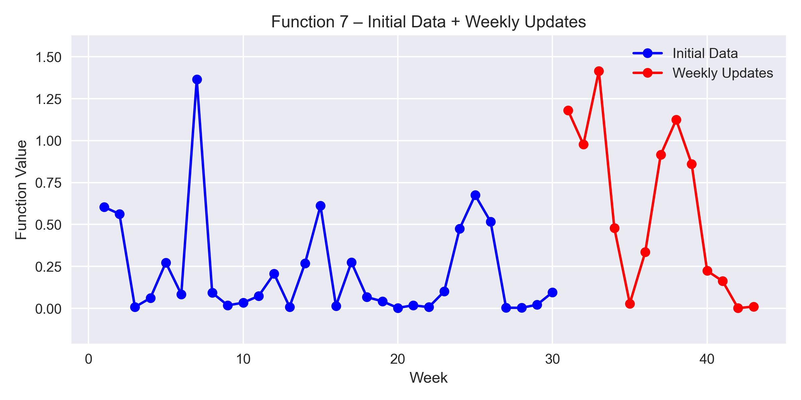
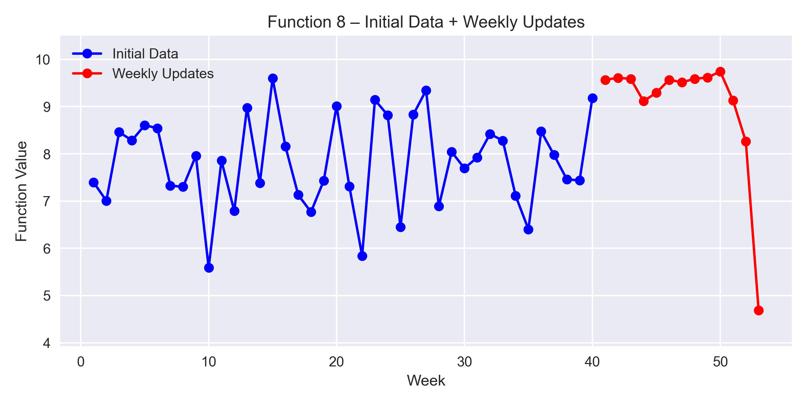

Results by function at Week 8

| Week | Function 1                   | Function 2               | Function 3                 | Function 4                 | Function 5             | Function 6               | Function 7               | Function 8           |
|------|------------------------------|---------------------------|-----------------------------|-----------------------------|-------------------------|---------------------------|---------------------------|-----------------------|
| 1    | -1.2487829338434956e-49      | 0.051646432712366415      | -0.11118571432117087        | -4.620232320523549         | 872.3074873002278      | -0.5377942602933444      | 1.181422704250112        | 9.5658               |
| 2    | -9.343447791332904e-112      | 0.18011924802681153       | -0.030680318237259866       | -4.939960051262183         | 743.1182481623213      | -0.7102415173770004      | 0.9769171261966855       | 9.6097592309634      |
| 3    | 4.5074380138539914e-133      | 0.5338269840060812        | -0.048179209676502605       | -5.313374447160626         | 1118.8725469008125     | -0.6833253974004205      | 1.415182353706698        | 9.5876553462161      |
| 4    | -1.5199719684953676e-55      | 0.5960813635984847        | -0.02040441290319508        | -12.867749036987885        | 386.6818739904094      | -1.4991274726694743      | 0.4790359561505474       | 9.1140770207914      |
| 5    | -6.688485279296031e-142      | 0.01686172630224915       | -0.1175388643248932         | -7.221570128386034         | 4564.328857219503      | -0.8866184075971868      | 0.028769356636723045     | 9.2921179841235      |
| 6    | -1.8022788966239472e-144     | 0.021320835230587712      | -0.1482910205289665         | -7.6005772787938355        | 6619.923795891087      | -2.0390133791009304      | 0.33553729563585927      | 9.5673490736736      |
| 7    | -1.3151574669815363e-142     | 0.04170782561126679       | -0.12635616438454833        | -4.550362897100278         | 6717.039990516725      | -2.3063646975145775      | 0.9161953953665816       | 9.5144374297026      |
| 8    | -0.004236010437020722        | 0.5976293971773099        | -0.037692123265023345       | -7.6909155928365855        | 3942.207447141211      | -0.6349274195629477      | 1.1241859989248546       | 9.5880031008211      |
| 9    | -0.0011513293804727184        | 0.565857330050682        | -0.029031619136784075       | -4.84733587428212        | 7705.825094042719      | -0.7453415482672865      | 0.8608279363272374       | 9.6158      |
| 10    | -5.41965897352555e-201        | 0.4902737196519932        | -0.751389275062385       | -18.09726561495884        | 1246.5123230669396      | -3.039360793240201      | 0.2237511524097176       | 9.74225711019      |
| 11    | -8.986546433822662e-192        | 0.570095676491088        | -0.1383251424785816       | -17.066167587084262        | 7827.226901543306      | -3.778114188571625      | 0.16253706042540253       | 9.127404806122101      |
| 12    | -8.402023908302191e-126        | -0.0410652057185971        | -0.45395156724018193       | -56.24358198613675        | 9832.0579380648      | -3.80102263557403      | 0.001138200184952793       | 8.261629402623      |
| 13    | -2.3669280403410248e-163        | 0.520499099703201        | -0.19385531924526878       | -8.922384421120626        | 49746.43502602013      | -3.5111732919849317      | 0.010664864856794742       | 4.683805284963599      |

Shown below are the raw plots of the results for the functions.

## Function 1
Detect likely contamination sources in a two-dimensional area, such as a radiation field, where only proximity yields a non-zero reading. The system uses Bayesian optimisation to tune detection parameters and reliably identify both strong and weak sources.

## Function 2
Imagine a black box, or a mystery ML model, that takes two numbers as input and returns a log-likelihood score. Your goal is to maximise that score, but each output is noisy, and depending on where you start, you might get stuck in a local optimum.
To tackle this, you use Bayesian optimisation, which selects the next inputs based on what it has learned so far. It balances exploration with exploitation, making it well suited to noisy outputs and complex functions with many local peaks.

## Function 3
You’re working on a drug discovery project, testing combinations of three compounds to create a new medicine. Each experiment is stored in initial_inputs.npy as a 3D array, where each row lists the amounts of the three compounds used. After each experiment, you record the number of adverse reactions, stored in initial_outputs.npy as a 1D array.Your goal is to minimise side effects; in this competition, it is framed as maximisation by optimising a transformed output (e.g. the negative of side effects).

## Function 4
Address the challenge of optimally placing products across warehouses for a business with high online sales, where accurate calculations are costly and only feasible biweekly. To speed up decision-making, an ML model approximates these results within hours. The model has four hyperparameters to tune, and its output reflects the difference from the expensive baseline. Because the system is dynamic and full of local optima, it requires careful tuning and robust validation to find reliable, near-optimal solutions.

## Function 5
You’re tasked with optimising a four-variable black-box function that represents the yield of a chemical process in a factory. The function is typically unimodal, with a single peak where yield is maximised. Your goal is to find the optimal combination of chemical inputs that delivers the highest possible yield, using systematic exploration and optimisation methods.

## Function 6
You’re optimising a cake recipe using a black-box function with five ingredient inputs, for example flour, sugar, eggs, butter and milk. Each recipe is evaluated with a combined score based on flavour, consistency, calories, waste and cost, where each factor contributes negative points as judged by an expert taster. This means the total score is negative by design. To frame this as a maximisation problem, your goal is to bring that score as close to zero as possible or, equivalently, to maximise the negative of the total sum.

## Function 7
You’re tasked with optimising an ML model by tuning six hyperparameters, for example learning rate, regularisation strength or number of hidden layers. The function you’re maximising is the model’s performance score (such as accuracy or F1), but since the relationship between inputs and output isn’t known, it’s treated as a black-box function. Because this is a commonly used model, you might benefit from researching best practices or literature to guide your initial search space. Your goal is to find the combination of hyperparameters that yields the highest possible performance.

## Function 8
You’re optimising an eight-dimensional black-box function, where each of the eight input parameters affects the output, but the internal mechanics are unknown. Your objective is to find the parameter combination that maximises the function’s output, such as performance, efficiency or validation accuracy. Because the function is high-dimensional and likely complex, global optimisation is hard, so identifying strong local maxima is often a practical strategy. For example, imagine you’re tuning an ML model with eight hyperparameters: learning rate, batch size, number of layers, dropout rate, regularisation strength, activation function (numerically encoded), optimiser type (encoded) and initial weight range. Each input set returns a single validation accuracy score between 0 and 1. Your goal is to maximise this score.

